# Design and Architecture Diagrams

## 1. Class Diagram

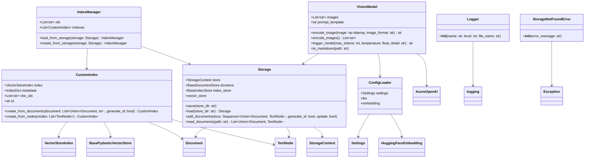

### Visibility Symbols in Mermaid Class Diagrams

- `+` : **Public** – The member is accessible from outside the class.
- `-` : **Private** – The member is accessible only within the class.
- `#` : **Protected** – The member is accessible within the class and its subclasses.

## 2. Module Dependency Diagram

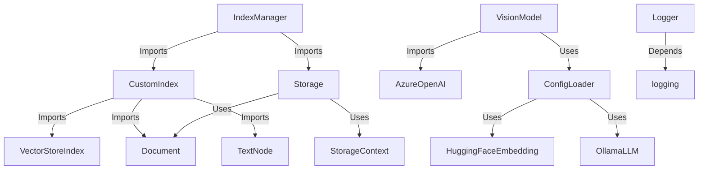

## 3. Sequence Diagram

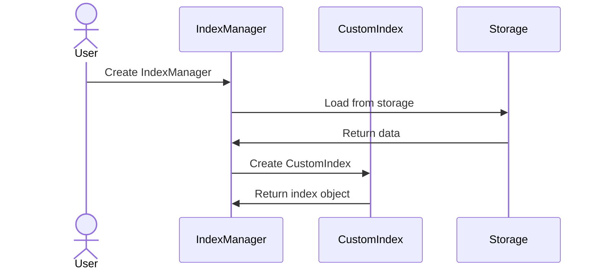

## 4. Component Diagram

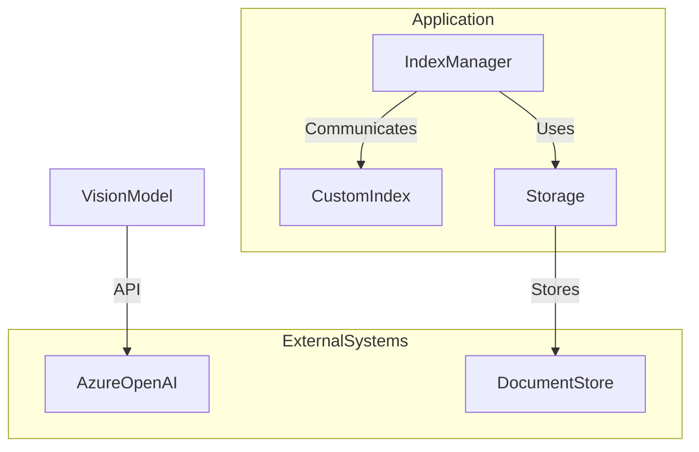

## 5. Deployment Diagram

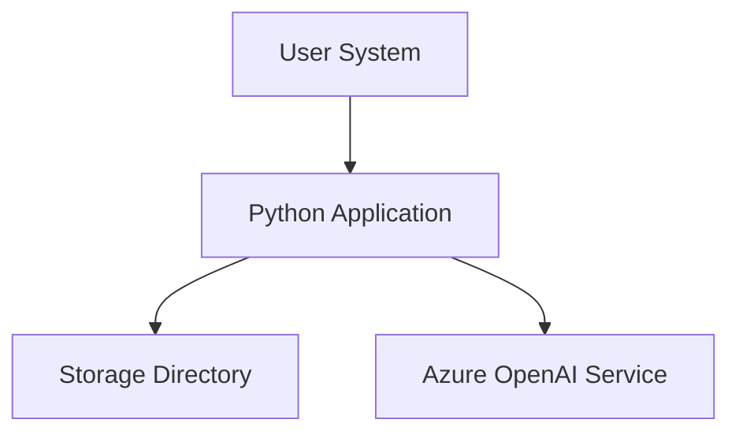

## 6.Data Flow Diagram

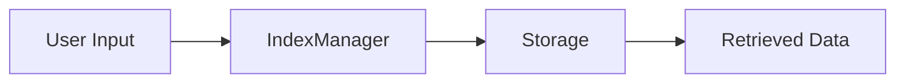

## 7.Deployment Diagram

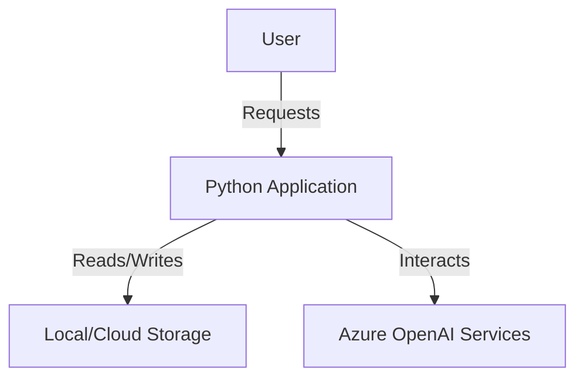

## 8.State Diagram

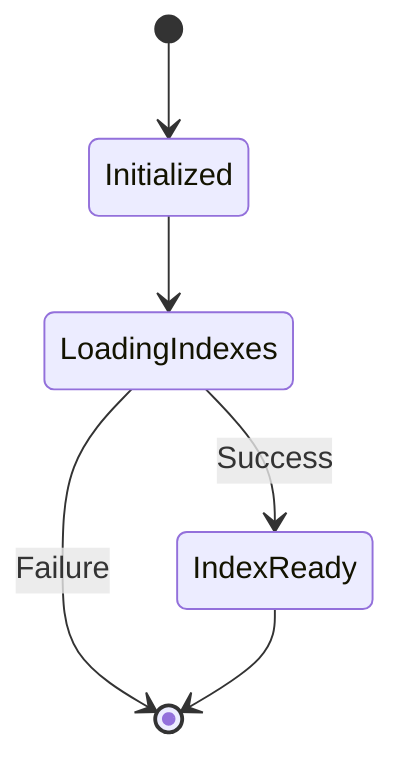

## 9.Activity Diagram

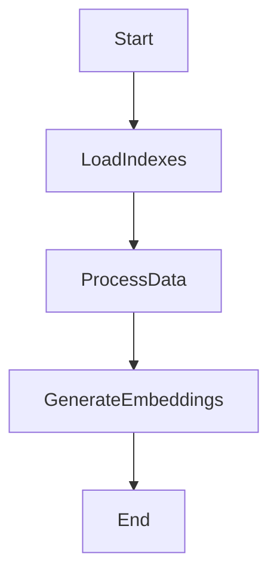

## 10.Package Diagram

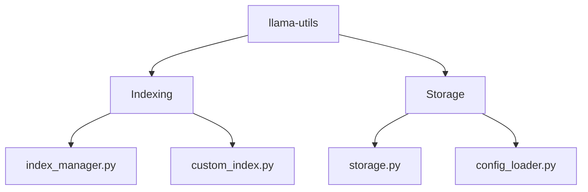

## 11.Network Diagram

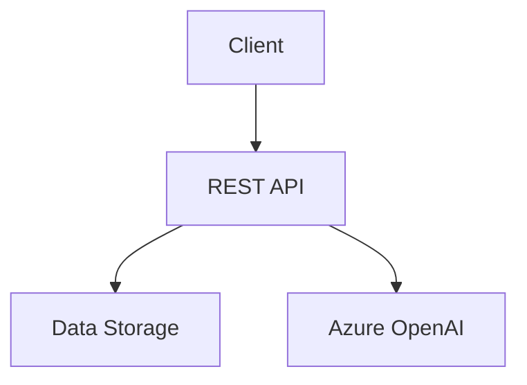
