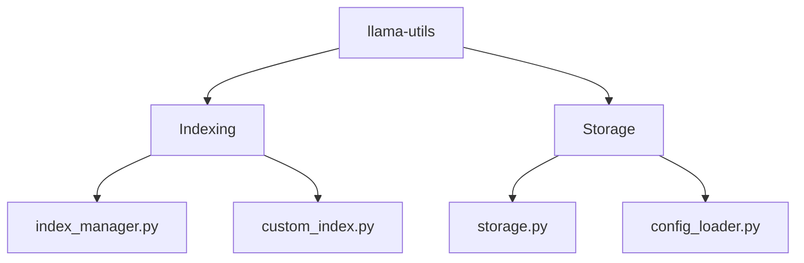

# llama-utils
LlamaIndex utility package

[](https://github.com/Serapieum-of-alex/llama-utils/actions/workflows/github-pages-mkdocs.yml)

[](https://www.gnu.org/licenses/gpl-3.0)
[](https://github.com/pre-commit/pre-commit)
[](https://lgtm.com/projects/g/MAfarrag/llama-utils/context:python)


[](https://codecov.io/gh/Serapieum-of-alex/llama-utils)
[](https://www.codacy.com/gh/Serapieum-of-alex/llama-utils/dashboard?utm_source=github.com&amp;utm_medium=referral&amp;utm_content=Serapieum-of-alex/llama-utils&amp;utm_campaign=Badge_Grade)


Current release info
====================

| Name                                                                                                                 | Downloads                                                                                                                                                                                                                                                                                                                                                                                                                                                                                                                   | Version                                                                                                                                                                                                                     | Platforms                                                                                                                                                                                                                                                                                                                                 |
|----------------------------------------------------------------------------------------------------------------------|-----------------------------------------------------------------------------------------------------------------------------------------------------------------------------------------------------------------------------------------------------------------------------------------------------------------------------------------------------------------------------------------------------------------------------------------------------------------------------------------------------------------------------|-----------------------------------------------------------------------------------------------------------------------------------------------------------------------------------------------------------------------------|-------------------------------------------------------------------------------------------------------------------------------------------------------------------------------------------------------------------------------------------------------------------------------------------------------------------------------------------|
| [](https://anaconda.org/conda-forge/llama-utils) | [](https://anaconda.org/conda-forge/llama-utils) [](https://pepy.tech/project/llama-utils) [](https://pepy.tech/project/llama-utils)  [](https://pepy.tech/project/llama-utils)   | [](https://anaconda.org/conda-forge/llama-utils) [](https://badge.fury.io/py/llama-utils) | [](https://anaconda.org/conda-forge/llama-utils) [](https://gitter.im/Hapi-Nile/Hapi?utm_source=badge&utm_medium=badge&utm_campaign=pr-badge&utm_content=badge) |

llama-utils - Large Language Model Utility Package
=====================================================================
**llama-utils** is a large language model utility package


Main Features
-------------

- llama-index

Package Overview
----------------



complete overview of the design and architecture [here](/docs/design_architecture_diagrams.md)

Installing llama-utils
===============

Installing `llama-utils` from the `conda-forge` channel can be achieved by:

```
conda install -c conda-forge llama-utils=0.2.0
```

It is possible to list all the versions of `llama-utils` available on your platform with:

```
conda search llama-utils --channel conda-forge
```

## Install from GitHub

to install the last development to time, you can install the library from GitHub

```
pip install git+https://github.com/Serapieum-of-alex/llama-utils
```

## pip

to install the last release, you can easily use pip

```
pip install llama-utils==0.2.0
```

Quick start
===========
- First download ollama from here [ollama](https://ollama.com/download) and install it.
- Then run the following command to pull the `llama3` model
```
ollama pull llama3
```
- Then run ollama server (if you get an error, check the errors section below to solve it)
```
ollama serve
```
Now you can use the `llama-utils` package to interact with the `ollama` server

```python
from llama_utils.retrieval.storage import Storage
STORAGE_DIR= "examples/data/llama3"
storage = Storage.create()
data_path = "examples/data/essay"
docs = storage.read_documents(data_path)
storage.add_documents(docs)
storage.save(STORAGE_DIR)
```
