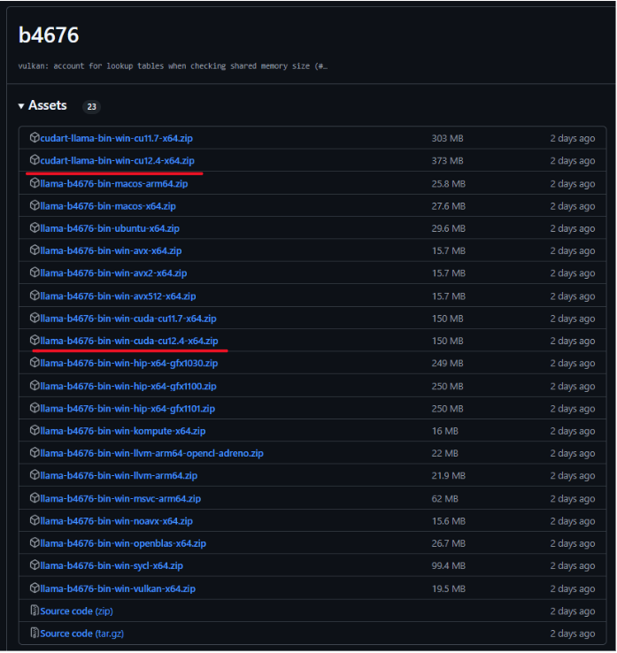
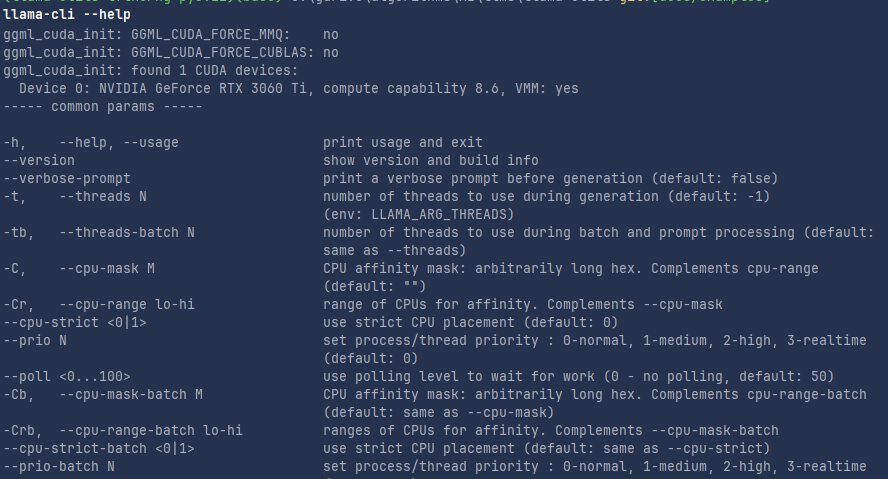
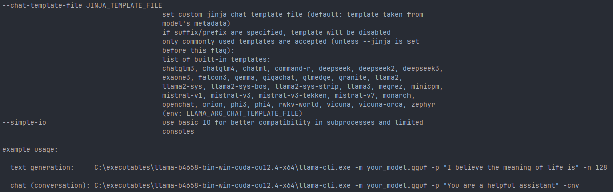
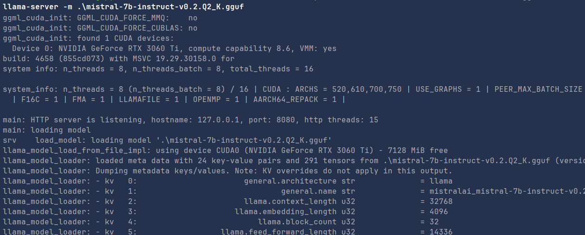

# Using Llama.cpp for Local LLM Inference

## Introduction

Llama.cpp is a powerful and efficient inference framework for running LLaMA models locally on your machine. Unlike other tools such as Ollama, LM Studio, and similar LLM-serving solutions, Llama.cpp is designed to provide high-performance, low-resource inference while offering flexibility for different hardware architectures.

### How Llama.cpp Compares to Other Tools

- **Llama.cpp vs. Ollama**: Ollama provides a more user-friendly experience with built-in model management, whereas Llama.cpp gives you full control over your models and hardware acceleration.
- **Llama.cpp vs. LM Studio**: LM Studio offers a GUI for managing models, whereas Llama.cpp is focused on CLI and scripting automation for advanced users.
- **Advantages of Llama.cpp**:
    - Lightweight and highly optimized for CPU inference.
    - Supports a variety of platforms including Windows, Linux, and macOS.
    - Allows fine-tuned control over model execution, including running models as servers or embedding them into Python applications.

This tutorial will guide you through the installation process on different operating systems and show you how to interact with LLMs using Python and HTTP requests.

## Installation

For detailed build instructions, refer to the official guide: [Llama.cpp Build Instructions](https://github.com/ggerganov/llama.cpp/blob/master/docs/build.md)
in the following I will explain the different pre-built binaries that you can download from the llama.cpp github 
repository and how to install them on your machine  

### Windows

#### Choosing the Right Binary

If you are downloading the pre-built binaries from the Llama.cpp releases page, choose the correct one based on your CPU and GPU capabilities:

- **`llama-b4671-bin-win-avx-x64.zip`**: For CPUs with basic AVX support (Intel Sandy Bridge and later, AMD Bulldozer and later).
- **`llama-b4671-bin-win-avx2-x64.zip`**: For CPUs with AVX2 support (Intel Haswell and later, AMD Excavator and later).
- **`llama-b4671-bin-win-avx512-x64.zip`**: For CPUs with AVX-512 support (Intel Skylake-X and newer, limited to certain Intel CPUs).
- **`llama-b4671-bin-win-cuda-cu11.7-x64.zip`** / **`llama-b4671-bin-win-cuda-cu12.4-x64.zip`**: For systems with NVIDIA GPUs that support CUDA. These versions utilize CUDA acceleration for improved inference speed.

If you are unsure, start with AVX2, as most modern CPUs support it. If your CPU is older, use the AVX version. If you have a high-end CPU, use the AVX-512 version for better performance. If you have an NVIDIA GPU and want to leverage CUDA, use the appropriate CUDA version matching your installed CUDA driver version.

<p align="center">
  
</p>

## Linux and MacOS

For Linux, download `llama-b4671-bin-ubuntu-x64.zip`, and for macOS, use `llama-b4671-bin-macos-x64.zip` or `llama-b4671-bin-macos-arm64.zip`. Extract them to a directory and add that directory to your system's environment variables to run the executables from any location.

you can also use the following installation using curl on linux
```shell
curl -fsSL https://ollama.com/install.sh | sh
```

After Downloading the right files, unzip the files and add the extracted directory to your system's environment variables to run the executables from any location.

## Understanding GGUF, GGML, Hugging Face, and LoRA Formats

### What is GGUF?

GGUF (Generalized GGML Unified Format) is an optimized file format designed for running large language models efficiently using Llama.cpp and other frameworks. It improves compatibility and performance by standardizing how model weights and metadata are stored, allowing for efficient inference on different hardware architectures.

### What is GGML?

GGML (Generalized Gradient Model Language) is an earlier format used for LLM inference that supports quantized models, making them more memory-efficient. However, GGUF has largely replaced GGML due to its enhanced features and improved performance.

### Converting GGML to GGUF

If you have a GGML model and need to use it with Llama.cpp, you can convert it to GGUF using a conversion script.

Example command:

```bash
python convert_llama_ggml_to_gguf.py --input model.ggml --output model.gguf
```
The convert_llama_ggml_to_gguf.py script exists in the llama.cpp github repository in the main directory.

### Hugging Face Format

Hugging Face models are typically stored in PyTorch (`.bin` or `.safetensors`) format. These models can be converted into GGUF format using conversion scripts like `convert_hf_to_gguf.py`.

### LoRA Format

LoRA (Low-Rank Adaptation) is a fine-tuning technique used to efficiently adapt large language models to specific tasks. LoRA adapters store only the fine-tuned weight differences rather than modifying the entire model. To use LoRA with Llama.cpp, you may need to merge LoRA weights with a base model before conversion to GGUF using `convert_lora_to_gguf.py`.

## Downloading GGUF Model Files from Hugging Face

You can download GGUF model files from Hugging Face and use them with Llama.cpp. Follow these steps:

1. **Visit Hugging Face Models Page**: Go to [Hugging Face](https://huggingface.co/) and search for LLaMA or any model compatible with GGUF. in this tutorial we will use the mistral gguf files downloaded from this link \`[https://huggingface.co/TheBloke/Mistral-7B-Instruct-v0.2-GGUF\`](https://huggingface.co/TheBloke/Mistral-7B-Instruct-v0.2-GGUF`)

2. **Download the Model**: Navigate to the model’s repository and download the GGUF version of the model. If the GGUF format is not available, you may need to convert it manually as explained before.

3. **Move the File**: Place the downloaded or converted GGUF model into your `models/` directory.

## Run a model:

Now we can use the command llama-cli that is one of the executables that we have downloaded, you can check all the flags that can be used with the llama-cli command to trigger the llm model using the gguf file.

```bash
llama-cli -m your-model.gguf
```

<p align="center">
  
</p>

<p align="center">
  
</p>

### Interacting with Llama.cpp in Python

#### Overview of `llama-cpp-python`

The `llama-cpp-python` package provides Python bindings for Llama.cpp, allowing users to:

- Load and run LLaMA models within Python applications.
- Perform text generation tasks using GGUF models.
- Customize inference parameters like temperature, top-k, and top-p for more controlled responses.
- Run models efficiently on both CPU and GPU (if CUDA is enabled).
- Host models as an API server for easy integration into applications.

#### Installing Required Packages

You can use `llama-cpp-python`, which provides Python bindings for llama.cpp:

```bash
pip install llama-cpp-python
```

#### Running Inference in Python

```python
from llama_cpp import Llama

llm = Llama(model_path="mistral-7b-instruct-v0.2.Q2_K.gguf")
response = llm.create_chat_completion(
  messages=[
    {
        "role": "user",
        "content": "how big is the sky"
    }
])
print(response)
```

The response will be something like

```plaintext
{
  'id': 'chatcmpl-e8879677-7335-464a-803b-30a15d68c015', 
  'object': 'chat.completion', 
  'created': 1739218403, 
  'model': 'mistral-7b-instruct-v0.2.Q2_K.gguf', 
  'choices': [
    {
      'index': 0, 
      'message': 
        {
          'role': 'assistant', 
          'content': ' The size of the sky is not something that can be measured in a way that 
          is meaningful to us, as it is not a physical object with defined dimensions. 
          The sky is the expanse above the Earth, and it includes the atmosphere and the outer 
          space beyond. It goes on forever in all directions, as far as our current understanding 
          of the universe extends. So, we cannot assign a specific size to the sky. 
          Instead, we can describe the size of specific parts of the universe, such as the diameter 
          of a star or the distance between two galaxies.'
        }, 
        'logprobs': None, 
        'finish_reason': 'stop'
    }
  ], 
  'usage': {
    'prompt_tokens': 13, 
    'completion_tokens': 112, 
    'total_tokens': 125
    }
}
```

### Downloading and Using GGUF Models with Llama.from_pretrained

The Llama.from_pretrained method allows users to directly download GGUF models from Hugging Face and use them 
without manually downloading the files.

Example:

```python
from llama_cpp import Llama

# Download and load a GGUF model directly from Hugging Face
llm = Llama.from_pretrained(
    repo_id="TheBloke/Mistral-7B-Instruct-v0.2-GGUF", 
    filename="mistral-7b-instruct-v0.2.Q4_K_M.gguf",
)

response = llm.create_chat_completion(
  messages=[
    {"role": "user", "content": "How does a black hole work?"}
  ]
)
print(response)
```
This method simplifies the process by automatically downloading and loading the required model into memory, eliminating the need to manually place GGUF files in a directory. and loading the gguf file from that directory.

- you can use the `cache_dir` parameter to specify the directory where the model will be downloaded and cached.

- the response will be something like 
```plaintext
{
    'id': 'chatcmpl-6049f7cd-5e8a-45c0-a69c-e15c1b8842bc', 
    'object': 'chat.completion', 
    'created': 1739220646, 
    'model': 'models--TheBloke--Mistral-7B-Instruct-v0.2-GGUF\\snapshots\\3a6fbf4a41a1d52e415a4958cde6856d34b2db93\\.\\mistral-7b-instruct-v0.2.Q2_K.gguf', 
    'choices': [
        {
            'index': 0, 
            'message': 
                {
                    'role': 'assistant', 
                    'content': ' A black hole is a region in space where the gravitational pull is so strong that nothing, 
                        not even light, can escape. The gravity of a black hole is so intense because matter is squeezed 
                        into a very small space.\n\nBlack holes are formed when a massive star collapses under its own 
                        gravity at the end of its life. The core collapses in on itself, forming a singularity, 
                        which is a point of infinite density and zero volume. The singularity is surrounded by an event 
                        horizon, which is the boundary of the black hole from which no escape is possible.\n\nThe 
                        intense gravity of a black hole warps the fabric of spacetime around it, causing a significant 
                        distortion in the paths of nearby stars and planets. This distortion is known as a gravitational 
                        singularity or a black hole.\n\nThe event horizon of a black hole is not a perfect sphere but 
                        rather an irregularly shaped surface that is constantly changing as the black hole interacts 
                        with nearby matter. The event horizon is also not a sharp boundary but rather a gradual 
                        transition from the outside universe to the inside of the black hole.
                        Black holes are not completely black but rather emit a faint glow due to the energy released 
                        from the intense gravitational forces at work. This glow is known as Hawking radiation, named 
                        after the physicist Stephen Hawking, who first proposed the idea.\n\nBlack holes come in 
                        different sizes, from stellar-mass black holes, which can be as small as a few solar masses, to 
                        supermassive black holes, which can be millions or billions of solar masses. The supermassive 
                        black holes are thought to be at the center of most galaxies, including our own Milky Way.
                        Black holes are fascinating objects in the universe, and scientists continue to study them to 
                        learn more about the fundamental laws of physics and the nature of spacetime.'
                }, 
                'logprobs': None, 
                'finish_reason': 'stop'
            }
        ], 
        'usage': {'prompt_tokens': 15, 'completion_tokens': 388, 'total_tokens': 403}
    }
}
```
## Running Llama.cpp as a Server

You can run `llama.cpp` as a server and interact with it via API calls.

### Start the Server

```bash
llama-server -m mistral-7b-instruct-v0.2.Q2_K.gguf
```

launching the model as a server in your terminal will give the following response.

<p align="center">
  
</p>

### Send Requests Using Python

```python
import requests

# Define the API endpoint
url = "http://localhost:8000/completion"

# Define the payload 
payload = {
    "model": "mistral-7b-instruct-v0.2.Q4_K_M.gguf",
    "prompt": "How big is the sky?",
    "temperature": 0.7,
    "max_tokens": 50
}

headers = {"Content-Type": "application/json"}
try:
    response = requests.post(url, json=payload, headers=headers)

    # Check if the request was successful
    if response.status_code == 200:
        # Parse the response JSON
        response_data = response.json()

        # Extract the result from the response
        choices = response_data.get("choices", [])
        if choices:
            result = choices[0].get("text", "")
            print("Response:", result)
        else:
            print("No choices found in the response.")
    else:
        print(f"Request failed with status code {response.status_code}: {response.text}")
except Exception as e:
    print(f"Error occurred: {e}")
```

The response will be something like

```
Response: 
The sky is not a tangible object and does not have physical dimensions, so it cannot be measured or quantified in the same way that we measure and quantify objects with size or dimensions. The sky is simply the vast expanse of

```

### Send Requests from Terminal (Linux/macOS) or PowerShell (Windows)

```bash
curl -X POST "http://localhost:8000/completion" \
     -H "Content-Type: application/json" \
     -d '{"prompt": "Tell me a fun fact.", "max_tokens": 50}'
```

## Conclusion

This tutorial covered installing, running, and interacting with Llama.cpp on different platforms. You can now integrate Llama models into your applications for local inference and API-based interactions.

